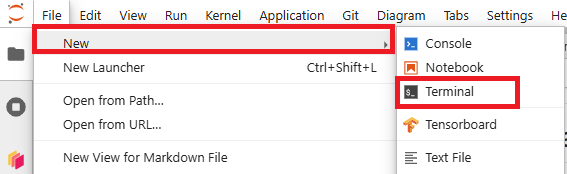

# EarthObservation_and_tws

<!-- #region -->
## Preparation on the crib platform

To run the tutorioals you need the [shxarray software](https://github.com/ITC-Water-Resources/shxarray). We've prepared an installation in a so called Python virtual environment (`pysh_aarch64`,..). 

In order to make this virtual environment available for you when creating notebooks, you still need to do some steps

### Clone the repository

1. From the Jupyter interface open a terminal File-> New -> Terminal

 

2. Clone the reposiotry
  ```sh
 git clone git@github.com:SedighehKarimi/EarthObservation_and_tws.git
 ```

3. In the terminal window, navigate to the shared folder

  ```sh
 cd shared/Hydrological-and-Environmental-Cycles-2024-1B/TerrestrialWaterStorage
 ```

<!-- #endregion -->

<!-- #region -->

### Activate the virtual environment

Activate the prepared Python virtual environment to enable the necessary libraries:
```sh
source pysh_aarch64/bin/activate
```
You will see the virtual environment name in your terminal prompt, indicating it is active. This ensures all required dependencies are available.


<!-- #endregion -->

<!-- #region -->

### Start the Tutorial

Now, navigate to the cloned repository and open the first tutorial:

1. Navivate to your cloned repository
```sh
private/EarthObservation_and_tws/
```
2. Open the Jupyter Notebook interface and double-click on `Tutorial_1_nocode.ipynb` 

Congratulations! You're ready to begin.

If you encounter any issue with any of the step please ask one of the instructors
<!-- #endregion -->

## Data Access

<!-- #region -->
The datasets required for this tutorial are already provided. Below is a guide to their locations and structure.

#### GRACE Spherical Harmonics Data
The monthly GRACE spherical harmonic solutions are stored in the shared directory:
```sh
shared/Hydrological-and-Environmental-Cycles-2024-1B/data
```

The folder structure includes:

* `monthly_solutions`: Monthly GRACE solutions.

* `monthly_background`: Background model files.

* `monthly_n96`: Processed GRACE solutions.

* `static`: Supporting static gravity files.

These datasets are critical for analyzing terrestrial water storage.

#### Basin Data
The basin data files (e.g., AMAZONAS.gpkg, GREENLAND.gpkg) are already included in the cloned repository under:
 ```sh
EarthObservation_and_tws/data/basins
 ```

The folder folder structure for this tutorial is

```
EarthObservation_and_tws
│   └───data 
│    └───basins # Basin data files
│       │  AMAZONAS.gpkg
│       │   ...
│       │   GREENLAND.gpkg
│       │   ...
│   README.md # Setup and tutorial instructions
│   requirements.txt # Python dependencies
│   setup.pipenv.sh # Script for setting up pipenv (optional)
│   Tutorial_1_nocode.ipynb # First tutorial (no code version)
│   Tutorial_1.ipynb # First tutorial (with code)
│   Tutorial_2.ipynb  # Second tutorial
```
<!-- #endregion -->
